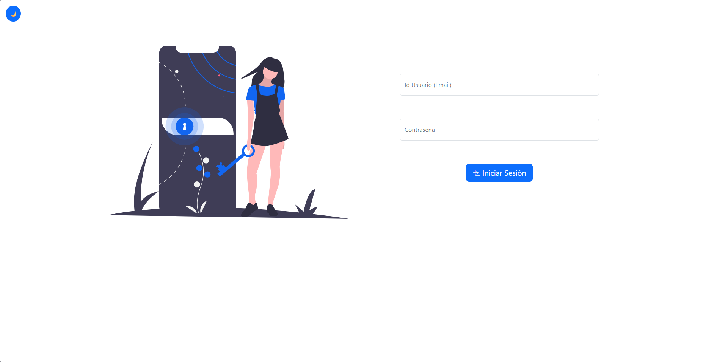
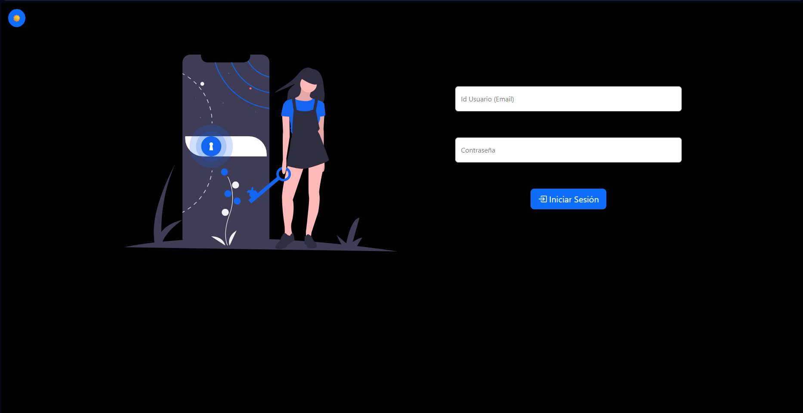
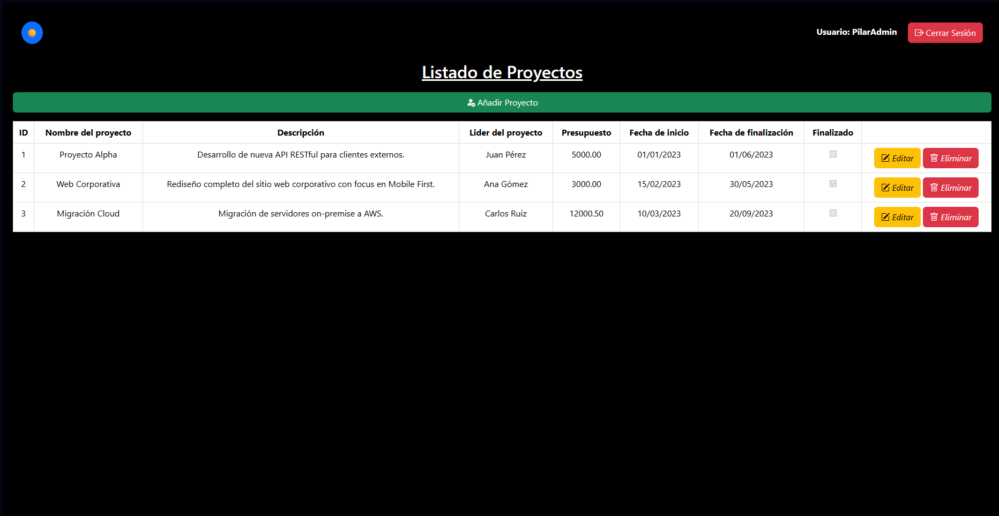
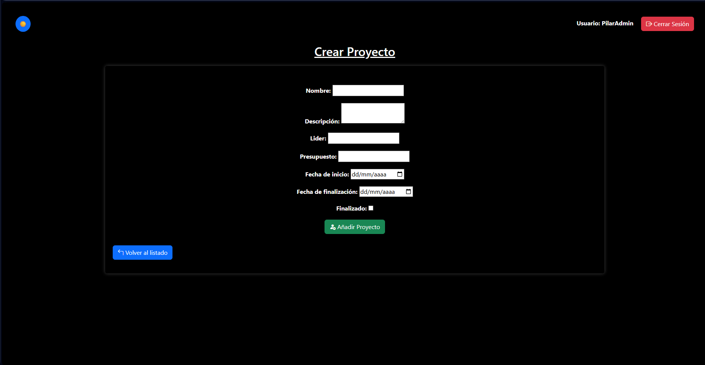
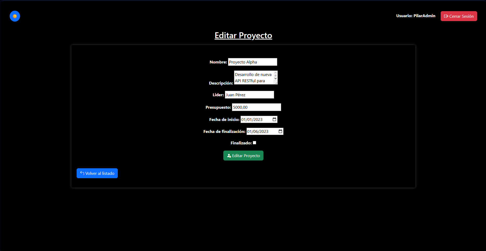
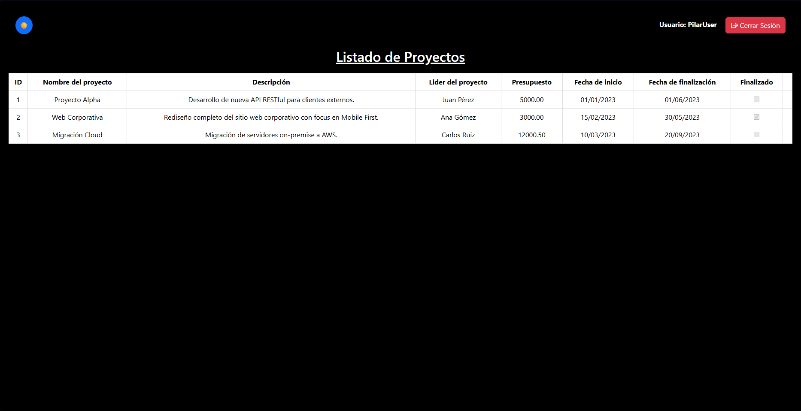

# Gestión de Proyectos - CRUD MVC Seguro en PHP

Sistema completo de gestión de proyectos con autenticación segura, roles de usuario (Admin/User) y operaciones CRUD, construido con **PHP 8**, **MariaDB** y una arquitectura modular **MVC**, siguiendo estrictas prácticas de seguridad.



## Descripción

Esta aplicación fusiona un **Sistema de Autenticación de Alta Seguridad** (Login-MVC) con un **Gestor de Proyectos** (CRUD). Permite a los administradores controlar el ciclo de vida de los proyectos, mientras que los usuarios limitados pueden consultar la información en modo lectura, garantizando la integridad y control de acceso en cada nivel.

---

## Capturas de Pantalla

### 1. Login Seguro
Modo oscuro con validación en cliente (JavaScript) y servidor (PHP).


### 2. Dashboard de Administrador
Acceso completo a todas las operaciones: Crear, Editar, Eliminar y Listar.


### 3. Formularios de Creación y Edición
Formularios de Creación y Edición reutilizando estilos y lógica de validación.



### 4. Vista de Usuario Limitado
Panel restringido donde las opciones de modificación están deshabilitadas visualmente y protegidas en el backend.


---

## Arquitectura MVC

El proyecto sigue el patrón **Modelo-Vista-Controlador** para separar responsabilidades, mejorando la mantenibilidad y escalabilidad del código:

```
CRUD-GestionDeProyectos/
├── Config/                        # Configuración y Seguridad
│   ├── Database.php               # Conexión PDO a las 2 bases de datos
│   ├── SessionConfig.php          # Configuración de cookies y sesiones seguras
│   └── SecurityHelper.php         # Sanitización y protección CSRF
│
├── Controllers/                   # Lógica de Negocio
│   ├── AuthController.php         # Gestión de Sesión, Login y Logout
│   └── GestionController.php      # Lógica CRUD de Proyectos
│
├── Models/                        # Acceso a Datos
│   ├── User.php                   # Modelo de usuarios (db: login-php)
│   └── Proyecto.php               # Modelo de proyectos (db: gestion_proyectos)
│
├── Views/                         # Interfaz de Usuario
│   ├── login.php                  # Pantalla de acceso
│   ├── dashboard-listar.php       # Vista principal (Listado)
│   ├── dashboard-crear.php        # Formulario de alta
│   ├── dashboard-editar.php       # Formulario de edición
│   ├── css/                       # Arquitectura CSS Modular
│   │   ├── login.css              # Estilos específicos de autenticación
│   │   ├── dashboard-comun.css    # Estilos base compartidos
│   │   ├── dashboard-listar.css   # Estilos del listado de proyectos
│   │   └── dashboard-form.css     # Estilos de formularios
│   └── js/                        # Validación Dinámica
│       ├── validarDatos.js        # Validación Login
│       ├── validarProyectos.js    # Validación CRUD
│       └── temaOscuro.js          # Lógica del modo oscuro
│
├── database/                      # Scripts SQL
│   ├── login-php.sql              # Estructura y datos de Usuarios
│   └── gestion_proyectos.sql      # Estructura y datos de Proyectos
│
├── index.php                      # Front Controller (Enrutador Único)
└── README.md                      # Documentación Técnica
```

### Flujo de la Aplicación

```
┌─────────────────────────────┐
│          index.php          │
│   (Front Controller)        │
│ 1. Carga SessionConfig.php  │  ← Inicia sesión segura (HttpOnly/Secure)
│ 2. Enrutamiento (Routing)   │     y decide qué Controlador instanciar
└──────────────┬──────────────┘
               │
               ▼
┌─────────────────────────────┐         ┌───────────────────────────┐
│       Controladores         │         │         Modelos           │
│ - AuthController            │ ──────▶ │ - User (login-php)        │
│ - GestionController         │ ◀────── │ - Proyecto (gestion_proy) │
│                             │         └───────────────────────────┘
│ * Validan Inputs (Sanitize) │
│ * Validan CSRF (Security)   │  ← SecurityHelper se usa aquí
└──────────────┬──────────────┘
               │
               ▼
┌─────────────────────────────┐
│           Vistas            │
│    HTML5 + CSS3 Modular     │  ← Renderiza la respuesta al usuario
│      + Bootstrap 5          │
└─────────────────────────────┘
```

### Descripción de Componentes

**1. Núcleo (Core):**
*   **`index.php`**: El **Controlador Frontal**. Recibe todas las peticiones, inicializa la sesión segura y decide qué controlador debe manejar la solicitud en función del parámetro `action`.

**2. Configuración y Seguridad:**
*   **`Database.php`**: Gestiona las conexiones PDO. Permite conectar tanto a la BD de usuarios (`login-php`) como a la de proyectos (`gestion_proyectos`) de forma centralizada.
*   **`SessionConfig.php`**: Configura los parámetros de seguridad de las cookies (HttpOnly, Secure, SameSite) y maneja los tiempos de expiración y regeneración de IDs.
*   **`SecurityHelper.php`**: Librería de utilidades estáticas para sanitizar inputs (`sanitizeInput`), validar tokens CSRF y controlar intentos de login.

**3. Controladores (Lógica):**
*   **`AuthController`**: Gestiona la autenticación. Verifica credenciales (Login), cierra la sesión de forma segura (Logout) y protege el acceso inicial.
*   **`GestionController`**: Administra el núcleo del CRUD. Verifica si el usuario tiene permiso (Admin) antes de crear, editar o eliminar proyectos, y prepara los datos para las vistas.

**4. Modelos (Datos):**
*   **`User`**: Interactúa con la base de datos `login-php`. Se encarga de verificar si un usuario existe y validar sus contraseñas (hash).
*   **`Proyecto`**: Interactúa con la base de datos `gestion_proyectos`. Encapsula todas las consultas SQL (INSERT, SELECT, UPDATE, DELETE) para mantener la integridad de los datos.

**5. Vistas (Interfaz):**
*   **`login.php`**: Formulario de acceso con validación JS y modo oscuro.
*   **`dashboard-listar.php`**: Vista principal. Muestra la tabla de proyectos y adapta los botones según el rol (Admin ve Editar/Eliminar/Crear, User solo ve la lista).
*   **`dashboard-crear/editar.php`**: Formularios reutilizables para el alta y modificación de proyectos.

---

## Características de Seguridad Implementadas

### 1. Validación JavaScript (Frontend)

Proporciona feedback inmediato. Verifica requisitos de complejidad de contraseña y formato de datos.

**Archivo:** `Views/js/validarDatos.js`

> <sub>javascript</sub>

```javascript
// Validación de complejidad de contraseña en tiempo real
if (password.length < 8 || password.length > 15 || /['"\\/<>=\(\)]/.test(password)) {
    mostrarError('passwordHelp', 'La contraseña debe tener entre 8 y 15 caracteres y no contener caracteres peligrosos');
    valido = false;
}
```

---

### 2. Sanitización PHP (Backend)

Protección obligatoria contra XSS (Cross-Site Scripting). Todos los datos entrantes se limpian antes de ser procesados.

**Archivo:** `Config/SecurityHelper.php`

> <sub>php</sub>

```php
public static function sanitizeInput($data)
{
    $data = trim($data);           // Eliminar espacios
    $data = stripslashes($data);   // Eliminar barras invertidas
    $data = htmlspecialchars($data, ENT_QUOTES, 'UTF-8');  // Convertir caracteres especiales
    return $data;
}
```

---

### 3. Cookies de Sesión Seguras

Configuración estricta de cookies para prevenir robos de sesión.

**Archivo:** `Config/SessionConfig.php`

> <sub>php</sub>

```php
session_set_cookie_params([
    'lifetime' => 7200,          // 2 horas de vida
    'path' => '/',
    'httponly' => true,          // Imposible de leer vía JavaScript (Anti-XSS)
    'samesite' => 'Strict',      // Solo se envía en peticiones del mismo sitio (Anti-CSRF)
]);
```

---

### 4. Protección CSRF (Cross-Site Request Forgery)

Cada sesión genera un token único que debe acompañar a cada formulario POST. Si el token no coincide, la petición se rechaza.

**Validación:** `Config/SecurityHelper.php`

> <sub>php</sub>

```php
public static function validateCSRFToken()
{
    // Compara el token enviado por el form con el de la sesión de forma segura
    return hash_equals($_SESSION['csrf_token'], $_POST['csrf_token']);
}
```

---

### 5. Control de Acceso Basado en Roles (RBAC)

El sistema distingue entre `admin` y `user`. Esta verificación se realiza en el servidor, no solo ocultando botones.

**Archivo:** `Controllers/GestionController.php`

> <sub>php</sub>

```php
// Ejemplo de protección de ruta crítica
public function delete()
{
    $this->checkAdmin(); // Si no es admin, redirige o detiene ejecución
    // ... lógica de borrado
}
```

---

### 6. Consultas SQL Preparadas (PDO)

Todas las interacciones con la base de datos usan `Prepared Statements` para evitar inyección SQL.

**Archivo:** `Models/Proyecto.php`

> <sub>php</sub>

```php
// Consulta segura con placeholders (?)
$query = "SELECT * FROM " . $this->tabla_nombre . " WHERE id = ? LIMIT 1";
$stmt = $this->PDO->prepare($query);
$stmt->bindParam(1, $id); // Bindeo seguro
$stmt->execute();
```

---

### 7. Validación de Datos (CRUD)

Al igual que en el login, aplicamos doble validación:
*   **Cliente (JS)**: Comprueba campos obligatorios, fechas lógicas (Fin > Inicio) y tipos de datos.
*   **Servidor (PHP)**: Saneamiento y validación final antes de insertar en la BD.

**Archivo:** `Views/js/validarProyectos.js`

> <sub>javascript</sub>

```javascript
// Validación lógica de fechas
if (new Date(fechaFin) < new Date(fechaInicio)) {
    messages.push("La fecha de finalización no puede ser anterior a la de inicio.");
    valid = false;
}
```

---

### 8. Protección de Rutas (CRUD)

Las operaciones críticas (`create`, `edit`, `delete`) están protegidas a nivel de controlador. No basta con conocer la URL; se verifica el rol en la sesión.

**Archivo:** `Controllers/GestionController.php`

> <sub>php</sub>

```php
public function create()
{
    // VERIFICACIÓN DE ROL: Solo admin puede crear
    if (!isset($_SESSION['rol']) || $_SESSION['rol'] !== 'admin') {
        header('Location: index.php?action=index&error=unauthorized');
        exit();
    }
    // ...
}
```

---

### 9. Límite de Intentos de Login
Protección contra fuerza bruta. Bloquea el acceso temporalmente (15 min) tras 5 intentos fallidos.

**Archivo:** `Config/SecurityHelper.php`

> <sub>php</sub>

```php
if ($_SESSION['login_attempts'] >= self::MAX_LOGIN_ATTEMPTS) {
    // Bloquear usuario...
}
```

---

### 10. Límite de Tiempo de Sesión
La sesión expira automáticamente tras 2 horas de inactividad absoluta para minimizar riesgos de olvido.

**Archivo:** `Config/SessionConfig.php`

> <sub>php</sub>

```php
$session_max_lifetime = 7200; // 2 horas
if (time() - $_SESSION['session_created'] >= $session_max_lifetime) {
    session_destroy();
}
```

---

### 11. Regeneración de ID de Sesión
Se regenera el ID de sesión cada 20 minutos para prevenir ataques de "Session Fixation".

**Archivo:** `Config/SessionConfig.php`

> <sub>php</sub>

```php
if (time() - $_SESSION['last_regeneration'] >= 1200) {
    session_regenerate_id(true);
}
```

---

### 12. Logout Seguro
Limpieza completa: destruye la sesión en el servidor y fuerza la expiración de la cookie en el navegador.

**Archivo:** `Controllers/AuthController.php`

> <sub>php</sub>

```php
setcookie(session_name(), '', time() - 42000, ...); // Borra cookie
session_destroy(); // Borra sesión
```

## Instalación y Credenciales

### 1. Base de Datos
Los scripts SQL incluyen la sentencia `CREATE DATABASE`, por lo que **no es necesario crear las bases de datos manualmente**.

1.  Accede a **phpMyAdmin** (normalmente [http://localhost/phpmyadmin](http://localhost/phpmyadmin)).
2.  Ve directamente a la pestaña superior **"Importar"** (sin seleccionar ninguna base de datos a la izquierda).
3.  Selecciona el archivo `database/login-php.sql` y pulsa **Continuar**.
4.  **Repite el proceso** importando el archivo `database/gestion_proyectos.sql`.

*Ambas bases de datos (`login-php` y `gestion_proyectos`) y el usuario de conexión (`LoginPhp`) se crearán automáticamente.*

### 2. Configuración de Conexión (Informativo)
La aplicación viene pre-configurada en `Config/Database.php` para usar el usuario que el script acaba de crear. **No es necesario configurar nada más**, pero aquí tienes los datos por si necesitas consultarlos o el script falla:

*   **Usuario**: `LoginPhp`
*   **Password**: `95f90HZJy3sb`

### 3. Usuarios de Acceso (Demo)

Para pruebas, el sistema incluye los siguientes usuarios pre-creados:

| Rol               | Usuario (ID) | Contraseña     | Permisos             |
| :---------------- | :----------- | :------------- | :------------------- |
| **Administrador** | `PilarAdmin` | `Password123!` | Todo (CRUD Completo) |
| **Usuario**       | `PilarUser`  | `Password123!` | Solo Lectura         |


---

## Tecnologías Utilizadas

| Tecnología     | Versión   | Uso                             |
| :------------- | :-------- | :------------------------------ |
| **PHP**        | 8.x       | Backend, Lógica de Negocio, PDO |
| **MariaDB**    | 10.x/11.x | Persistencia de Datos           |
| **phpMyAdmin** | 5.x       | Gestión de Base de Datos        |
| **Bootstrap**  | 5.3.8     | Framework CSS (Responsive)      |
| **JavaScript** | ES6       | Validación Cliente              |
| **HTML5/CSS3** | -         | Estructura y Estilos Modulares  |

---

## Referencias

**Documentación del ejercicio:**
- [LOGIN CON PHP + MARIADB - Patrón MVC](https://charmed-group-fc8.notion.site/LOGIN-CON-PHP-MARIADB-2b960ff317c980ed822dc0ad370f173d)
- [CRUD MVC EN PHP](https://charmed-group-fc8.notion.site/CRUD-MVC-EN-PHP-2c460ff317c9809698e6daf909f9e7d6)

**Documentación técnica:**
- [PHP Manual - Password Hashing](https://www.php.net/manual/es/function.password-hash.php)
- [PHP Manual - Sessions](https://www.php.net/manual/es/book.session.php)
- [PDO Prepared Statements](https://www.php.net/manual/es/pdo.prepared-statements.php)
- [PHP Manual - PDOStatement::rowCount](https://www.php.net/manual/es/pdostatement.rowcount.php)